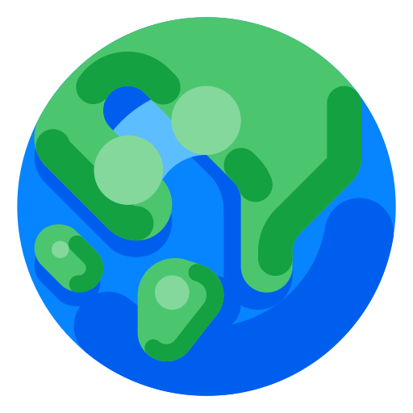

# 
Around the World

Aplicação de página única (SPA) que consulta e exibe dados a partir da API <b><a href="https://restcountries.com/">REST Countries</a></b>. O projeto foi feito com o intuito de pôr em prática alguns conceitos básicos no desenvolvimento de webapps como: 

 - FetchAPI e Programação Assíncrona
 - Protocolo HTTP
 - Estrutura de dados
 - Algoritmos de ordenação e busca
 - Paralelismo
 - Renderização de componentes HTML/CSS via Javascript
 - Encapsulamento de estados e eventos na programação funcional através das clojures

Também foi um boa oportunidade de explorar o Bootstrap pela primeira vez e ver na prática as vantagens que oferece.

# 🔨 Funcionalidades

Por se tratar de uma API desenvolvida e distribuida em inglês, todo o aplicativo encontra-se na mesma linguagem por questões de padronização.

A aplicação é responsiva e pode ser visualizada em celulares, tablets e desktops. Além disso, a aplicação conta com um tema claro e um tema escuro que pode ser selecionado automaticamente de acordo com a preferência de sistema do usuário.

 
 

Como inicialmente todos os +200 países são carregados para consulta do usuário, foi necessário o uso da técnica de Lazy Loading para carregar pequenas porções de países conforme o evento de scroll do usuário. Na versão mobile somente 2 cards são carregados por scroll enquanto que na versão tablet e desktop, 4 e 8 cards respectivamente.

Isso, somado ao uso de Webpack e Web Workers para lidar com o fetch de dados, ajudou a reduzir drasticamente o tempo de carregamento e renderização inicial.

Ao clicar em qualquer um dos cards apresentados, mais detalhes sobre o país selecionado serão mostrados em um offcanvas que pode ser fechado com o botão superior direito ou ao voltar no navegador ou dispositivos mobile. Também é possivel navegar até os outros países que fazem fronteira se caso houverem.
 

 
 

Os países podem ser filtrados por continente e/ou ordenados por nome e população.
Apesar da aplicação estar atualmente em inglês, o mesmo permite a busca usando um vasto numero de termos, além do próprio nome, como:

- Região (Africa, Americas, Europe etc)
- Capital
- Nomes alternativos
- Top-level Domain (.br, .cz, .uk etc)
- Nome traduzido (Permitindo o usuário pesquisar em sua língua nativa)
- Linguagem falada
- Nacionalidade (Somente em inglês)

# 📁 Acesso
O link de acesso está na descrição.

# ✔️ Técnicas e tecnologias usadas

- ``ECMAScript 6``
- ``Bootstrap``
- ``Webpack``
- ``Manipulação do DOM``
- ``Paradígma de orientação a eventos``
- ``Programação funcional``
- ``Programação assíncrona``
- ``Computação paralela``

